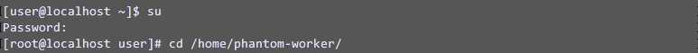
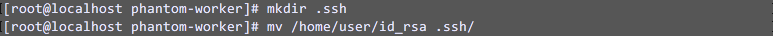
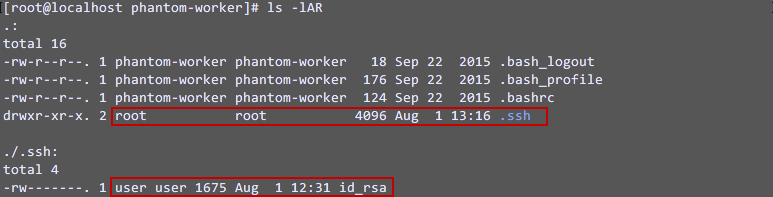
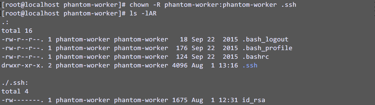

# SSH

Publisher: Splunk \
Connector Version: 2.4.5 \
Product Vendor: Generic \
Product Name: SSH \
Minimum Product Version: 6.2.0

This app supports executing various endpoint-based investigative and containment actions on an SSH endpoint

**Note:** This app will only support Linux distributions and Mac OS X. The app internally uses the
Paramiko module to establish an SSH connection with the server, and per the official Paramiko
documentation, it does not support non-standard SSH implementations or host systems. See [this
link](http://www.paramiko.org/faq.html#paramiko-doesn-t-work-with-my-cisco-windows-or-other-non-unix-system)
for more details.

## Root access permissions

If you are logging in as the root user (or a user otherwise configured to not need to use sudo),
then be sure to check the "User is root" box in the asset configuration. Otherwise, you will have to
provide a password if you want to run commands that require root access even if the RSA key is
specified, as required by your sudoers configuration. If you incorrectly specify that the account is
root, or if you incorrectly enter a password in conjunction with the RSA key, then the action may
indefinitely hang.

## Pseudo-terminal

In certain scenarios, it may be necessary to enable the pseudo-terminal for `     sudo    ` commands
where **requiretty** is enabled in the sudoers config. In that case, you can:

- disable the **requiretty** requirement on the server-side or
- enable pseudo-terminal in your asset config.

However, if it is not required, it should be disabled. Otherwise, the app may hang indefinitely when
used with servers where pseudo-terminals are not supported.

## Key-based authentication

Refer to the following steps to install the authentication keys in on-prem instance. Note that the
key pair must be unencrypted and generated using `     ssh-keygen    ` .

**Note:** The screenshots attached below are for Non-NRI instances having **/home/phantom-worker**
as the home directory. For NRI instances, consider **/home/phanru** as the home directory and
**phanru** as the user. If you are using different user, then consider **/home/{your_user_name}** as
the home directory and **{your_user_name}** as the user. The steps would remain the same with only a
minor change that the user would be **phanru** or **{your_user_name}** instead of **phantom-worker**
.

1. Connect to your Phantom instance and sudo to root. Change the current directory to
   phantom-worker's home directory using `       cd /home/phantom-worker/      `

   

1. Create a directory for the SSH keys (NOTE: You must give it the name .ssh). If you already have
   a key pair, move the private key files into this directory. In this case, the file
   `       id_rsa      ` has been added to the user's home directory using scp.

   

   It is entirely possible to generate a new key pair from the Phantom VM. To generate the key
   using `       ssh-keygen      ` , refer to the following steps:

   - Generate a new key pair using the command `        ssh-keygen -f .ssh/id_rsa       `
   - Once an SSH key pair has been generated, the ssh-copy-id command can be used to install it
     as an authorized key on the server. Use the command
     `        ssh-copy-id -i .ssh/id_rsa <user>@<host>       ` . Here, the \<user> and \<host>
     refer to the SSH server where you want to execute the SSH commands/Phantom actions. The
     command may request a password or other authentication for the server.

   The RSA public key is successfully added to the server.

1. Once the files are in the correct place, the ownership of the .ssh directory needs to be set
   using `      chown -R phantom-worker:phantom-worker .ssh     ` . To verify whether the owner of
   the .ssh folder is successfully updated or not use the `      ls -lAR     ` command.\
   

   Using the `       chown      ` command:

   

The RSA key should be ready to use in the SSH asset. Based on the above example, configure this by
specifying 'id_rsa' as the RSA key file. In the case of a different user, the absolute path to the
key must be specified. For example, if keys are added using username **testuser** having the home
directory **/home/testuser** then **/home/testuser/.ssh/id_rsa** should be specified as the RSA key
file.

## Disable SHA2 Algorithms Parameter

The 'disable_sha2' parameter in the asset can be checked when the SSH instance is old one which does
not have the support of either RSA2 or the "server-sig-algs" protocol extension.

## Verify Last Reboot Time

After successfully logging into your SSH server, run the command `     last reboot    ` which will
display all the previous reboot dates and times for the system.

### Configuration variables

This table lists the configuration variables required to operate SSH. These variables are specified when configuring a SSH asset in Splunk SOAR.

VARIABLE | REQUIRED | TYPE | DESCRIPTION
-------- | -------- | ---- | -----------
**username** | required | string | Username |
**root** | optional | boolean | User is root |
**password** | optional | password | Password |
**rsa_key_file** | optional | string | RSA Key file |
**ip_hostname** | optional | string | Device IP/Hostname (for test connectivity only) |
**timeout** | optional | numeric | Seconds before timeout (will be applicable for all actions) |
**pseudo_terminal** | optional | boolean | Enable pseudo-terminal when running sudo commands |
**disable_sha2** | optional | boolean | Disable SHA2 Algorithms (For Older SSH instances) |

### Supported Actions

[test connectivity](#action-test-connectivity) - Validates endpoint connection \
[execute program](#action-execute-program) - Executes a program on the remote machine \
[list connections](#action-list-connections) - Lists all the network connections. Requires root privileges. Requires netstat to be installed \
[block ip](#action-block-ip) - Add an iptables rule to the Linux server. Requires root privileges. Not supported on OS X \
[list firewall rules](#action-list-firewall-rules) - Lists the rules in iptables. Requires root privileges. Not supported on OS X \
[delete firewall rule](#action-delete-firewall-rule) - Delete a firewall rule. Requires root privileges. Not supported on OS X \
[reboot system](#action-reboot-system) - Reboot the endpoint (Requires root privileges) \
[shutdown system](#action-shutdown-system) - Shutdown the endpoint(Requires root privileges) \
[terminate process](#action-terminate-process) - Terminate a process (Requires root privileges) \
[logoff user](#action-logoff-user) - Logout a user on endpoint (Requires root privileges) \
[list processes](#action-list-processes) - List processes on endpoint \
[get disk usage](#action-get-disk-usage) - Retrieve disk usage from endpoint \
[get memory usage](#action-get-memory-usage) - Retrieve memory usage from endpoint \
[get file](#action-get-file) - Retrieve a file from the endpoint and save it to the vault \
[put file](#action-put-file) - Put a file from the vault to another location

## action: 'test connectivity'

Validates endpoint connection

Type: **test** \
Read only: **False**

#### Action Parameters

No parameters are required for this action

#### Action Output

No Output

## action: 'execute program'

Executes a program on the remote machine

Type: **generic** \
Read only: **False**

Please provide a value for the 'timeout' parameter when executing continuous commands such as 'ping' so that the action does not keep running indefinitely.

#### Action Parameters

PARAMETER | REQUIRED | DESCRIPTION | TYPE | CONTAINS
--------- | -------- | ----------- | ---- | --------
**ip_hostname** | required | Hostname/IP to execute command on | string | `ip` `host name` |
**command** | optional | Command to be executed on endpoint | string | |
**script_file** | optional | Local path to shell script | string | |
**timeout** | optional | Seconds before timeout. If an invalid value or 0 is entered, the timeout specified in the asset configuration will be used (default: 0) | numeric | |

#### Action Output

DATA PATH | TYPE | CONTAINS | EXAMPLE VALUES
--------- | ---- | -------- | --------------
action_result.status | string | | success failed |
action_result.parameter.command | string | | ls |
action_result.parameter.ip_hostname | string | `ip` `host name` | 192.168.0.1 |
action_result.parameter.script_file | string | | /opt/phantom/\<file_name> |
action_result.parameter.timeout | numeric | | 30 |
action_result.data.\*.output | string | | Shell Output |
action_result.summary.exit_status | numeric | | 0 |
action_result.message | string | | Command successfully executed and shell returned no errors |
summary.total_objects | numeric | | 1 |
summary.total_objects_successful | numeric | | 1 |

## action: 'list connections'

Lists all the network connections. Requires root privileges. Requires netstat to be installed

Type: **investigate** \
Read only: **True**

Executes the following command <code>sudo -S netstat -etnp</code> On OS X the following command is executed instead <code>sudo -S lsof -nP -i</code> Note that the name of the command in the output is limited to 9 characters.

#### Action Parameters

PARAMETER | REQUIRED | DESCRIPTION | TYPE | CONTAINS
--------- | -------- | ----------- | ---- | --------
**ip_hostname** | required | Hostname/IP to list network connections on | string | `ip` `host name` |
**local_addr** | optional | Local IP to filter on | string | `ip` |
**local_port** | optional | Local port to match | numeric | `port` |
**remote_addr** | optional | Remote IP to filter on | string | `ip` |
**remote_port** | optional | Remote port to match | numeric | `port` |

#### Action Output

DATA PATH | TYPE | CONTAINS | EXAMPLE VALUES
--------- | ---- | -------- | --------------
action_result.status | string | | success failed |
action_result.parameter.ip_hostname | string | `ip` `host name` | 192.168.0.1 |
action_result.parameter.local_addr | string | `ip` | 10.1.16.18 |
action_result.parameter.local_port | numeric | `port` | 8888 |
action_result.parameter.remote_addr | string | `ip` | 10.1.19.21 |
action_result.parameter.remote_port | numeric | `port` | 52678 |
action_result.data.\*.connections.\*.cmd | string | | sshd: |
action_result.data.\*.connections.\*.inode | string | | 159395 |
action_result.data.\*.connections.\*.local_ip | string | `ip` | 10.1.16.18 |
action_result.data.\*.connections.\*.local_port | string | `port` | 8888 |
action_result.data.\*.connections.\*.pid | string | `pid` | 17903 |
action_result.data.\*.connections.\*.protocol | string | | tcp |
action_result.data.\*.connections.\*.rec_q | string | | 0 |
action_result.data.\*.connections.\*.remote_ip | string | `ip` | 10.1.19.21 |
action_result.data.\*.connections.\*.remote_port | string | `port` | 52678 |
action_result.data.\*.connections.\*.send_q | string | | 0 |
action_result.data.\*.connections.\*.state | string | | ESTABLISHED |
action_result.data.\*.connections.\*.uid | string | | 0 |
action_result.summary.exit_status | numeric | | 0 |
action_result.message | string | | Command successfully executed and shell returned no errors |
summary.total_objects | numeric | | 1 |
summary.total_objects_successful | numeric | | 1 |

## action: 'block ip'

Add an iptables rule to the Linux server. Requires root privileges. Not supported on OS X

Type: **contain** \
Read only: **False**

Need to specify either an IP or a port to block. Executes the following command <code>sudo -S iptables -I \<DIRECTION> -p \<PROTOCOL> \<IP> \<PORT> -j DROP -m \<COMMENT></code> where the IP and PORT fields will block either source or destination based on the DIRECTION. Only iptables is supported.

#### Action Parameters

PARAMETER | REQUIRED | DESCRIPTION | TYPE | CONTAINS
--------- | -------- | ----------- | ---- | --------
**ip_hostname** | required | Hostname/IP to add firewall rule to | string | `ip` `host name` |
**remote_ip** | optional | Remote IP to block | string | `ip` `host name` |
**remote_port** | optional | Remote port to block | numeric | `port` |
**protocol** | required | Protocol to block | string | |
**direction** | required | Inbound or outbound | string | |
**comment** | optional | Leave a comment | string | |

#### Action Output

DATA PATH | TYPE | CONTAINS | EXAMPLE VALUES
--------- | ---- | -------- | --------------
action_result.status | string | | success failed |
action_result.parameter.comment | string | | comment to add |
action_result.parameter.direction | string | | In Out |
action_result.parameter.ip_hostname | string | `ip` `host name` | 192.168.0.1 |
action_result.parameter.protocol | string | | tcp |
action_result.parameter.remote_ip | string | `ip` `host name` | 10.1.19.21 |
action_result.parameter.remote_port | numeric | `port` | 52678 |
action_result.data.\*.output | string | | Shell Output |
action_result.summary.exit_status | numeric | | 0 |
action_result.message | string | | Command successfully executed and shell returned no errors |
summary.total_objects | numeric | | 1 |
summary.total_objects_successful | numeric | | 1 |

## action: 'list firewall rules'

Lists the rules in iptables. Requires root privileges. Not supported on OS X

Type: **investigate** \
Read only: **True**

Executes the following command <code>sudo -S iptables -L \<CHAIN> --line-numbers -n</code> Only iptables is supported.

#### Action Parameters

PARAMETER | REQUIRED | DESCRIPTION | TYPE | CONTAINS
--------- | -------- | ----------- | ---- | --------
**ip_hostname** | required | Hostname/IP to list firewall rules on | string | `ip` `host name` |
**protocol** | optional | Protocol to match | string | |
**port** | optional | Port to match | numeric | `port` |
**chain** | optional | Chain to match (INPUT, OUTPUT, etc.) | string | |

#### Action Output

DATA PATH | TYPE | CONTAINS | EXAMPLE VALUES
--------- | ---- | -------- | --------------
action_result.status | string | | success failed |
action_result.parameter.chain | string | | INPUT |
action_result.parameter.ip_hostname | string | `ip` `host name` | 192.168.0.1 |
action_result.parameter.port | numeric | `port` | 8888 |
action_result.parameter.protocol | string | | tcp |
action_result.data.\*.rules.\*.chain | string | | INPUT |
action_result.data.\*.rules.\*.destination | string | | 0.0.0.0/0 |
action_result.data.\*.rules.\*.num | string | | 1 |
action_result.data.\*.rules.\*.options | string | | ctstate RELATED,ESTABLISHED |
action_result.data.\*.rules.\*.protocol | string | | tcp |
action_result.data.\*.rules.\*.source | string | | 0.0.0.0/0 |
action_result.data.\*.rules.\*.target | string | | DOCKER |
action_result.summary.exit_status | numeric | | 0 |
action_result.message | string | | Command successfully executed and shell returned no errors |
summary.total_objects | numeric | | 1 |
summary.total_objects_successful | numeric | | 1 |

## action: 'delete firewall rule'

Delete a firewall rule. Requires root privileges. Not supported on OS X

Type: **correct** \
Read only: **False**

Executes the following command <code>sudo -S iptables -D \<CHAIN> \<NUMBER></code> Only iptables is supported.

#### Action Parameters

PARAMETER | REQUIRED | DESCRIPTION | TYPE | CONTAINS
--------- | -------- | ----------- | ---- | --------
**ip_hostname** | required | Hostname/IP of endpoint | string | `ip` `host name` |
**chain** | required | Name of chain (INPUT, OUTPUT, etc.) | string | |
**number** | required | Number of rule to delete | numeric | |

#### Action Output

DATA PATH | TYPE | CONTAINS | EXAMPLE VALUES
--------- | ---- | -------- | --------------
action_result.status | string | | success failed |
action_result.parameter.chain | string | | INPUT |
action_result.parameter.ip_hostname | string | `ip` `host name` | 192.168.0.1 |
action_result.parameter.number | numeric | | 1 |
action_result.data.\*.output | string | | Shell Output |
action_result.summary.exit_status | numeric | | 0 |
action_result.message | string | | Command successfully executed and shell returned no errors |
summary.total_objects | numeric | | 1 |
summary.total_objects_successful | numeric | | 1 |

## action: 'reboot system'

Reboot the endpoint (Requires root privileges)

Type: **contain** \
Read only: **False**

Executes the following command <code>sudo -S shutdown -r now</code>

#### Action Parameters

PARAMETER | REQUIRED | DESCRIPTION | TYPE | CONTAINS
--------- | -------- | ----------- | ---- | --------
**ip_hostname** | required | Hostname/IP of server to reboot | string | `ip` `host name` |

#### Action Output

DATA PATH | TYPE | CONTAINS | EXAMPLE VALUES
--------- | ---- | -------- | --------------
action_result.status | string | | success failed |
action_result.parameter.ip_hostname | string | `ip` `host name` | 192.168.0.1 |
action_result.data.\*.output | string | | Shell returned no errors |
action_result.summary.exit_status | numeric | | 0 |
action_result.message | string | | Exit status: -1. Please refer the docs to verify the last reboot time |
summary.total_objects | numeric | | 1 |
summary.total_objects_successful | numeric | | 1 |

## action: 'shutdown system'

Shutdown the endpoint(Requires root privileges)

Type: **contain** \
Read only: **False**

Executes the following command <code>sudo -S shutdown -h now</code>

#### Action Parameters

PARAMETER | REQUIRED | DESCRIPTION | TYPE | CONTAINS
--------- | -------- | ----------- | ---- | --------
**ip_hostname** | required | Hostname/IP of server to shutdown | string | `ip` `host name` |

#### Action Output

DATA PATH | TYPE | CONTAINS | EXAMPLE VALUES
--------- | ---- | -------- | --------------
action_result.status | string | | success failed |
action_result.parameter.ip_hostname | string | `ip` `host name` | 192.168.0.1 |
action_result.data.\*.output | string | | Shell returned no errors |
action_result.summary.exit_status | numeric | | 0 |
action_result.message | string | | Endpoint successfully shutdown. Command successfully executed and shell returned no errors |
summary.total_objects | numeric | | 1 |
summary.total_objects_successful | numeric | | 1 |

## action: 'terminate process'

Terminate a process (Requires root privileges)

Type: **contain** \
Read only: **False**

Executes the following command <code>sudo -S kill -SIGKILL \<PID></code>

#### Action Parameters

PARAMETER | REQUIRED | DESCRIPTION | TYPE | CONTAINS
--------- | -------- | ----------- | ---- | --------
**ip_hostname** | required | Hostname/IP of endpoint | string | `ip` `host name` |
**pid** | required | PID of process to terminate | numeric | `pid` |

#### Action Output

DATA PATH | TYPE | CONTAINS | EXAMPLE VALUES
--------- | ---- | -------- | --------------
action_result.status | string | | success failed |
action_result.parameter.ip_hostname | string | `ip` `host name` | 192.168.0.1 |
action_result.parameter.pid | numeric | `pid` | 12345 |
action_result.data.\*.output | string | | Successfully terminated pid <pid> |
action_result.summary.exit_status | numeric | | 0 |
action_result.message | string | | Command successfully executed and shell returned no errors |
summary.total_objects | numeric | | 1 |
summary.total_objects_successful | numeric | | 1 |

## action: 'logoff user'

Logout a user on endpoint (Requires root privileges)

Type: **contain** \
Read only: **False**

Executes the following command <code>sudo -S pkill -SIGKILL \<USER_NAME></code> This will terminate any sessions with this user as well as any other processes which they are running. Be careful when running this with certain users (i.e. root).

#### Action Parameters

PARAMETER | REQUIRED | DESCRIPTION | TYPE | CONTAINS
--------- | -------- | ----------- | ---- | --------
**ip_hostname** | required | Hostname/IP of endpoint | string | `ip` `host name` |
**user_name** | required | Name of user to logout | string | `user name` |

#### Action Output

DATA PATH | TYPE | CONTAINS | EXAMPLE VALUES
--------- | ---- | -------- | --------------
action_result.status | string | | success failed |
action_result.parameter.ip_hostname | string | `ip` `host name` | 192.168.0.1 |
action_result.parameter.user_name | string | `user name` | testuser |
action_result.data.\*.output | string | | Successfully logged off user: <user> |
action_result.summary.exit_status | numeric | | 0 |
action_result.message | string | | Command successfully executed and shell returned no errors |
summary.total_objects | numeric | | 1 |
summary.total_objects_successful | numeric | | 1 |

## action: 'list processes'

List processes on endpoint

Type: **investigate** \
Read only: **True**

Executes the following command <code>ps c -Ao user,uid,pid,ppid,stime,command</code>

#### Action Parameters

PARAMETER | REQUIRED | DESCRIPTION | TYPE | CONTAINS
--------- | -------- | ----------- | ---- | --------
**ip_hostname** | required | Hostname/IP of endpoint | string | `ip` `host name` |

#### Action Output

DATA PATH | TYPE | CONTAINS | EXAMPLE VALUES
--------- | ---- | -------- | --------------
action_result.status | string | | success failed |
action_result.parameter.ip_hostname | string | `ip` `host name` | 192.168.0.1 |
action_result.data.\*.processes.\*.command | string | | systemd |
action_result.data.\*.processes.\*.pid | string | `pid` | 12345 |
action_result.data.\*.processes.\*.ppid | string | `pid` | 2 |
action_result.data.\*.processes.\*.stime | string | | 05:00 |
action_result.data.\*.processes.\*.uid | string | | 0 |
action_result.data.\*.processes.\*.user | string | `user name` | testuser |
action_result.summary.exit_status | numeric | | 0 |
action_result.summary.total_processes | numeric | | 12 |
action_result.message | string | | Total processes: 10 |
summary.total_objects | numeric | | 1 |
summary.total_objects_successful | numeric | | 1 |

## action: 'get disk usage'

Retrieve disk usage from endpoint

Type: **investigate** \
Read only: **True**

#### Action Parameters

PARAMETER | REQUIRED | DESCRIPTION | TYPE | CONTAINS
--------- | -------- | ----------- | ---- | --------
**ip_hostname** | required | Hostname/IP to execute command on | string | `ip` `host name` |

#### Action Output

DATA PATH | TYPE | CONTAINS | EXAMPLE VALUES
--------- | ---- | -------- | --------------
action_result.status | string | | success failed |
action_result.parameter.ip_hostname | string | `ip` `host name` | 192.168.0.1 |
action_result.data.\*.\*.Avail | string | | 43G |
action_result.data.\*.\*.Filesystem | string | | /dev/mapper/centos-root |
action_result.data.\*.\*.Mounted on | string | | / |
action_result.data.\*.\*.Size | string | | 50G |
action_result.data.\*.\*.Use% | string | | 15 |
action_result.data.\*.\*.Used | string | | 7.2G |
action_result.data.\*.\*.raw | string | | /dev/mapper/centos-root 50G 7.2G 43G 15 / |
action_result.summary.exit_status | numeric | | 0 |
action_result.message | string | | Successfully executed command |
summary.total_objects | numeric | | 1 |
summary.total_objects_successful | numeric | | 1 |

## action: 'get memory usage'

Retrieve memory usage from endpoint

Type: **investigate** \
Read only: **True**

#### Action Parameters

PARAMETER | REQUIRED | DESCRIPTION | TYPE | CONTAINS
--------- | -------- | ----------- | ---- | --------
**ip_hostname** | required | Hostname/IP to execute command on | string | `ip` `host name` |

#### Action Output

DATA PATH | TYPE | CONTAINS | EXAMPLE VALUES
--------- | ---- | -------- | --------------
action_result.status | string | | success failed |
action_result.parameter.ip_hostname | string | `ip` `host name` | 192.168.0.1 |
action_result.data.\*.\*.Available | string | | 3.1G |
action_result.data.\*.\*.Buff/Cache | string | | 2.7G |
action_result.data.\*.\*.Free | string | | 1.1G |
action_result.data.\*.\*.Shared | string | | 306M |
action_result.data.\*.\*.Total | string | | 5.7G |
action_result.data.\*.\*.Type | string | | Mem: |
action_result.data.\*.\*.Used | string | | 1.9G |
action_result.data.\*.\*.raw | string | | Mem: 5.7G 1.9G 1.1G 306M 2.7G 3.1G |
action_result.summary.exit_status | numeric | | 0 |
action_result.message | string | | Successfully executed command |
summary.total_objects | numeric | | 1 |
summary.total_objects_successful | numeric | | 1 |

## action: 'get file'

Retrieve a file from the endpoint and save it to the vault

Type: **investigate** \
Read only: **True**

The file path needs to be an absolute path. For example, <b>/home/USER/file.tgz</b> instead of <b>~/file.tgz</b>.

#### Action Parameters

PARAMETER | REQUIRED | DESCRIPTION | TYPE | CONTAINS
--------- | -------- | ----------- | ---- | --------
**ip_hostname** | required | Hostname/IP to execute command on | string | `ip` `host name` |
**file_path** | required | Full path of the file to download (include filename) | string | `file path` |

#### Action Output

DATA PATH | TYPE | CONTAINS | EXAMPLE VALUES
--------- | ---- | -------- | --------------
action_result.status | string | | success failed |
action_result.parameter.file_path | string | `file path` | /home/USER/file.tgz |
action_result.parameter.ip_hostname | string | `ip` `host name` | 192.168.0.1 |
action_result.data | string | | |
action_result.summary.exit_status | numeric | | 0 |
action_result.summary.name | string | | file.tgz |
action_result.summary.size | numeric | | 412 |
action_result.summary.vault_id | string | `vault id` | dc871f816c4d179f3a3cea24b4bc81a67562c |
action_result.message | string | | Transferred file |
summary.total_objects | numeric | | 1 |
summary.total_objects_successful | numeric | | 1 |

## action: 'put file'

Put a file from the vault to another location

Type: **generic** \
Read only: **False**

The file path needs to be an absolute path. For example, <b>/home/USER/</b> instead of <b>~/USER</b>.

#### Action Parameters

PARAMETER | REQUIRED | DESCRIPTION | TYPE | CONTAINS
--------- | -------- | ----------- | ---- | --------
**ip_hostname** | required | Hostname/IP to execute command on | string | `ip` `host name` |
**vault_id** | required | Vault ID of file | string | `vault id` |
**file_destination** | required | File destination path (exclude filename) | string | `file path` |

#### Action Output

DATA PATH | TYPE | CONTAINS | EXAMPLE VALUES
--------- | ---- | -------- | --------------
action_result.status | string | | success failed |
action_result.parameter.file_destination | string | `file path` | /home/USER/ |
action_result.parameter.ip_hostname | string | `ip` `host name` | 192.168.0.1 |
action_result.parameter.vault_id | string | `vault id` | dc871f816c4d179f3a3cea24b4bc81a67562c |
action_result.data | string | | |
action_result.summary.file_sent | string | `file path` | /home/USER/file.tgz |
action_result.message | string | | File sent: /home/USER/file.tgz |
summary.total_objects | numeric | | 1 |
summary.total_objects_successful | numeric | | 1 |

______________________________________________________________________

Auto-generated Splunk SOAR Connector documentation.

Copyright 2025 Splunk Inc.

Licensed under the Apache License, Version 2.0 (the "License");
you may not use this file except in compliance with the License.
You may obtain a copy of the License at

http://www.apache.org/licenses/LICENSE-2.0

Unless required by applicable law or agreed to in writing,
software distributed under the License is distributed on an "AS IS" BASIS,
WITHOUT WARRANTIES OR CONDITIONS OF ANY KIND, either express or implied.
See the License for the specific language governing permissions and limitations under the License.
